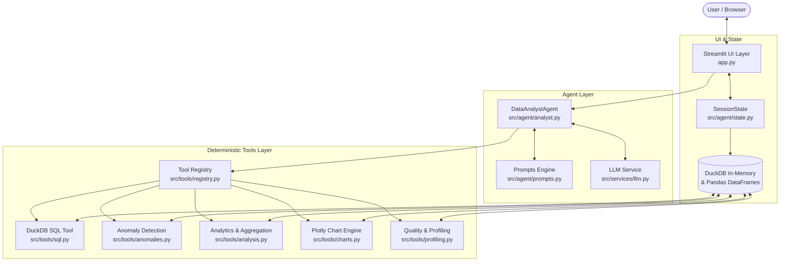

# AI-Powered Data Analyst

A production-grade, conversational Data Analyst platform that enables users to upload single or multiple CSV files, ask questions in natural language, detect anomalies, view interactive visualizations, and inspect deterministic data insights.

Built for the **Digital Back Office Software Engineer Intern Assignment**.

---

## 🌟 Key Features

1. **Multi-File CSV Upload & Schema Validation**:
   - Supports uploading multiple CSV files simultaneously.
   - Automatically profiles columns, null percentages, distinct counts, and data distributions.
   - Computes an end-to-end **Data Quality Score** with structural sanity checks.

2. **Conversational Natural Language Interface**:
   - Answer analytical questions without inventing or hallucinating numbers.
   - Maintains multi-turn conversational session context.

3. **Deterministic Tool Calling & Orchestration**:
   - Implements a strict **7-step analytical lifecycle**:
     1. Parse user question & conversation context
     2. Inspect dataset catalog schema & column statistics
     3. Formulate structured analytical plan (`QueryPlan` via Pydantic schema)
     4. Call deterministic analytical tool (`DuckDB`, `Pandas`, `Plotly`)
     5. Receive verified computational results
     6. Validate results integrity
     7. Synthesize transparent natural-language explanation with business takeaways

4. **Safe SQL Analytics (DuckDB)**:
   - Registers all uploaded CSVs as in-memory DuckDB tables.
   - Enforces read-only safety validation to block `DROP`, `DELETE`, `INSERT`, `UPDATE`, `ALTER`, etc.
   - Enables multi-table joins (e.g. joining sales with customer tables).

5. **Statistical Anomaly Detection**:
   - **Interquartile Range (IQR)**: Tukey's Fences method ($Q_1 - 1.5 \times \text{IQR}$, $Q_3 + 1.5 \times \text{IQR}$).
   - **Z-Score Method**: Standard score threshold detection ($|Z| > 3.0$).
   - Provides exact mathematical bounds, baseline values, and contextual explanations.

6. **Interactive Visualizations (Plotly)**:
   - Dynamic bar, line, pie/donut, scatter, histogram, and box plots.
   - Styled with modern dark theme and responsive layout.

7. **Explainability & Code Generation**:
   - Provides step-by-step execution traces explaining how every answer was obtained.
   - Displays generated DuckDB SQL and equivalent Pandas code for auditing and transparency.
   - **No unrestricted `exec()`**: User data and host environment remain completely secure.

8. **Offline / Out-of-the-Box Heuristic Fallback**:
   - Runs seamlessly even without an external paid API key using built-in deterministic heuristic planning.
   - Fully compatible with OpenAI, Gemini (via OpenAI compatibility endpoint), Groq, and Ollama.

---

## 🏗️ Architecture & Component Separation



### Strict Layer Decoupling:
- **UI (`app.py`)**: Responsible only for user input rendering, layout, and visualization display. Zero business logic.
- **Agent (`src/agent/`)**: Orchestrates the 7-step analytical lifecycle. Manages context, prompts, and tool dispatching.
- **Tools (`src/tools/`)**: Isolated deterministic calculation engines with strict typed contracts.
- **Services (`src/services/`)**: LLM transport and JSON schema enforcement.
- **Models (`src/models/`)**: Pydantic v2 schemas for all inputs, plans, and outputs.
- **Utils (`src/utils/`)**: Structured logging and configuration.

---

## 📁 Project Directory Structure

```text
ai-data-analyst/
├── app.py                      # Streamlit application UI
├── src/
│   ├── agent/
│   │   ├── __init__.py
│   │   ├── analyst.py          # 7-step DataAnalystAgent orchestrator
│   │   ├── prompts.py          # Grounded system prompts
│   │   └── state.py            # Session state, DuckDB catalog, and chat history
│   ├── tools/
│   │   ├── __init__.py
│   │   ├── profiling.py        # Dataset statistical profiling & data quality checks
│   │   ├── analysis.py         # Top-k, aggregations, correlations, time-series
│   │   ├── sql.py              # Safe read-only DuckDB SQL execution
│   │   ├── charts.py           # Plotly interactive chart generation
│   │   ├── anomalies.py        # IQR and Z-Score outlier detection
│   │   └── registry.py         # Central tool registry with type validation
│   ├── services/
│   │   ├── __init__.py
│   │   └── llm.py              # LLM client (OpenAI/Gemini/Ollama) & offline heuristic
│   ├── models/
│   │   ├── __init__.py
│   │   └── schemas.py          # Pydantic data contracts and models
│   └── utils/
│       ├── __init__.py
│       └── logging.py          # Structured logging configuration
├── data/
│   └── samples/
│       ├── sales_data.csv      # Sample sales transactions with intentional outlier
│       └── customers.csv       # Sample customer records for multi-table joins
├── tests/
│   ├── test_profiling.py       # Data quality and profiling unit tests
│   ├── test_sql.py             # SQL safety and DuckDB execution tests
│   ├── test_analysis.py        # Analytical calculations tests
│   ├── test_anomalies.py       # IQR and Z-Score tests
│   ├── test_charts.py          # Plotly visualization tests
│   └── test_agent.py           # End-to-end agent orchestration tests
├── docs/
│   └── architecture.md         # Detailed architectural documentation
├── requirements.txt            # Python dependencies
├── .env.example                # Environment variables template
├── .gitignore                  # Git ignore rules
├── Dockerfile                  # Production container definition
├── docker-compose.yml          # Container orchestration configuration
└── README.md                   # Documentation and setup guide
```

---

## 🚀 Getting Started with uv

This project is managed with [uv](https://github.com/astral-sh/uv), the high-performance Python package manager.

### Prerequisites
- [uv](https://docs.astral.sh/uv/getting-started/installation/) installed (`curl -LsSf https://astral.sh/uv/install.sh | sh`)
- Python 3.11+ (uv will automatically download Python 3.12 if not installed)
- Docker (optional, for containerized run)

### Local Setup with uv

1. **Clone the repository:**
   ```bash
   git clone <repo-url>
   cd ai-data-analyst
   ```

2. **Sync dependencies and create environment:**
   ```bash
   uv sync
   ```
   *This automatically creates `.venv`, installs all dependencies from `uv.lock`, and builds the project.*

3. **Configure environment (optional):**
   ```bash
   cp .env.example .env
   ```
   *Note: If no API key is specified, the application automatically uses its built-in deterministic heuristic orchestrator, allowing 100% of features to run offline.*

4. **Run the Streamlit application:**
   ```bash
   uv run streamlit run app.py
   ```
   Open your browser at `http://localhost:8501`.

---

## 🧪 Running Tests with uv

```bash
uv run pytest tests/ -v
```

---

## 🐳 Docker Deployment

Run the complete application inside a container (built with `uv`):

```bash
docker compose up --build
```
The app will be available immediately at `http://localhost:8501`.

---

## 💡 Example Analytical Queries

Try these questions using the pre-loaded sample datasets:

| Analysis Type | Example Question | Tool Executed |
|---|---|---|
| **Ranking** | *"Which region generated the highest revenue?"* | `top_k_analysis` |
| **Outliers** | *"Detect anomalies in revenue and explain why they were flagged."* | `detect_anomalies` (IQR) |
| **Trends** | *"Show the monthly sales trend."* | `time_series_trend` / `generate_chart` |
| **Performance**| *"Which products are underperforming?"* | `top_k_analysis` (ascending) |
| **SQL** | *"Generate SQL for sales by region."* | `execute_sql_query` |
| **Visualizations**| *"Generate a bar chart of profit by region."* | `generate_chart` |
| **Data Quality** | *"Run a data quality audit on the active dataset."* | `check_data_quality` |

---

## 🛡️ Security & Design Assumptions

1. **Deterministic Grounding**: The LLM is never permitted to produce numerical outputs unassisted. All numbers shown in answers originate directly from verified tool outputs.
2. **Code Execution Safety**: Generated Pandas or SQL code is shown for developer transparency and auditing; arbitrary user or LLM code is **never passed to `exec()` or `eval()`**.
3. **DuckDB Isolation**: In-memory DuckDB connections run with read-only validation against destructive keywords (`DROP`, `DELETE`, `ALTER`, `ATTACH`).
4. **Resilience**: The system gracefully falls back to statistical summaries if an external LLM request times out.
