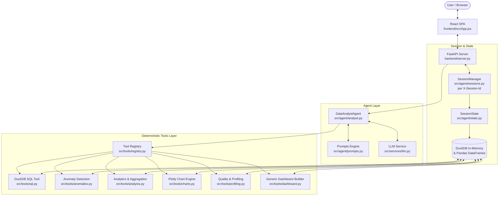
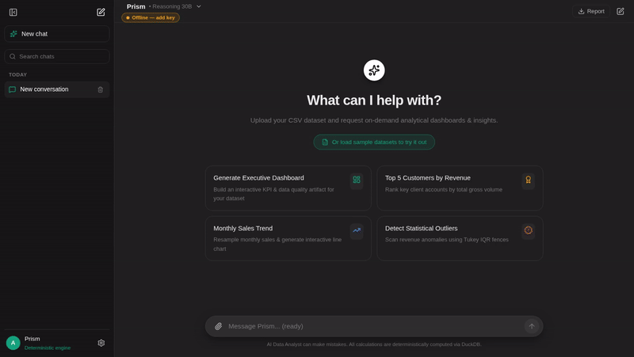
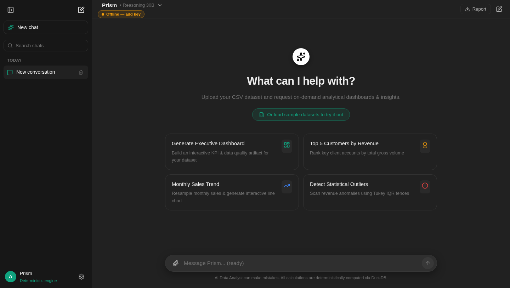
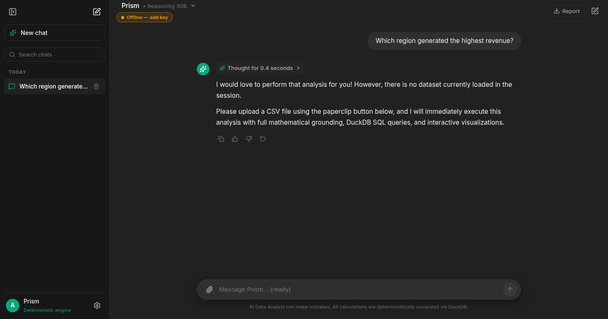
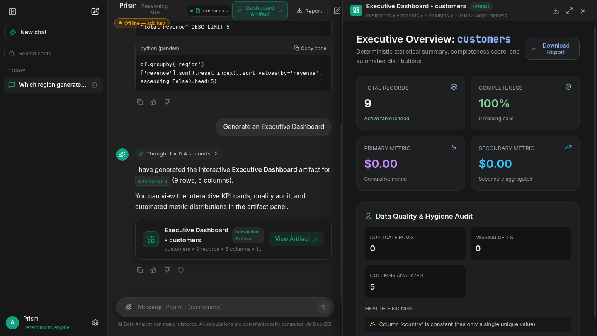
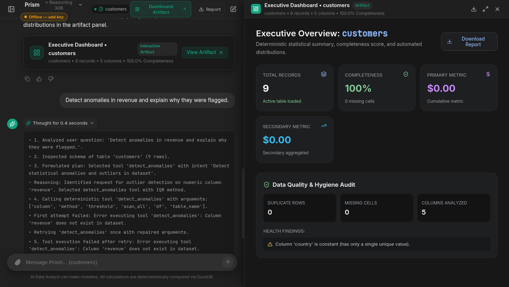

# AI-Powered Data Analyst (Prism)

[](https://github.com/SanthoshG0wda/prism)
[](https://github.com/SanthoshG0wda/prism)
[](https://github.com/SanthoshG0wda/prism#docker-deployment)
[](https://github.com/SanthoshG0wda/prism)

> **Repository URL**: [https://github.com/SanthoshG0wda/prism](https://github.com/SanthoshG0wda/prism)  
> **Assignment**: Digital Back Office Software Engineer Intern Assignment

A production-grade, conversational Data Analyst platform that enables users to upload single or multiple CSV files, ask questions in natural language, detect anomalies, view interactive visualizations, and inspect deterministic data insights.

---

## 🌟 Key Features

1. **Multi-File CSV Upload & Schema Validation**:
   - Supports uploading multiple CSV files simultaneously.
   - Automatically profiles columns, null percentages, distinct counts, and data distributions.
   - Computes an end-to-end **Data Quality Score** with structural sanity checks.

2. **Conversational Natural Language Interface**:
   - Answer analytical questions without inventing or hallucinating numbers.
   - Maintains multi-turn conversational session context.

3. **Deterministic Tool Calling & Orchestration**:
   - Implements a strict **7-step analytical lifecycle**:
     1. Parse user question & conversation context
     2. Inspect dataset catalog schema & column statistics
     3. Formulate structured analytical plan (`QueryPlan` via Pydantic schema)
     4. Call deterministic analytical tool (`DuckDB`, `Pandas`, `Plotly`)
     5. Receive verified computational results
     6. Validate results integrity
     7. Synthesize transparent natural-language explanation with business takeaways

4. **Safe SQL Analytics (DuckDB)**:
   - Registers all uploaded CSVs as in-memory DuckDB tables.
   - Enforces read-only safety validation to block `DROP`, `DELETE`, `INSERT`, `UPDATE`, `ALTER`, etc.
   - Enables multi-table joins (e.g. joining sales with customer tables).

5. **Statistical Anomaly Detection**:
   - **Interquartile Range (IQR)**: Tukey's Fences method ($Q_1 - 1.5 \times \text{IQR}$, $Q_3 + 1.5 \times \text{IQR}$).
   - **Z-Score Method**: Standard score threshold detection ($|Z| > 3.0$).
   - Provides exact mathematical bounds, baseline values, and contextual explanations.

6. **Interactive Visualizations (Plotly)**:
   - Dynamic bar, line, pie/donut, scatter, histogram, and box plots.
   - Styled with modern dark theme and responsive layout.

7. **Explainability & Code Generation**:
   - Provides step-by-step execution traces explaining how every answer was obtained.
   - Displays generated DuckDB SQL and equivalent Pandas code for auditing and transparency.
   - **No unrestricted `exec()`**: User data and host environment remain completely secure.

8. **Offline / Out-of-the-Box Heuristic Fallback**:
   - Runs seamlessly even without an external paid API key using built-in deterministic heuristic planning.
   - Fully compatible with OpenAI, Gemini (via OpenAI compatibility endpoint), Groq, and Ollama.

9. **ChatGPT-Style Streaming UX**:
   - `POST /api/chat-stream` streams live status, answer tokens (NIM `stream:true`), and a final result event over SSE.
   - Stop-generation button, regenerate-response button, chat search, persisted model/key settings, and an Executive Dashboard artifact panel.

---

## 🏗️ Architecture & Component Separation



> Note: The legacy Streamlit UI (`backend/app.py`) is deprecated and not part of the
> served stack. The production UI is the React SPA served by FastAPI.

### Strict Layer Decoupling:
- **UI (`frontend/src/`)**: React SPA — input rendering, layout, visualization display. Zero business logic.
- **API (`backend/server.py`)**: FastAPI REST + static SPA serving + per-session routing via `X-Session-Id` (`src/agent/sessions.py`).
- **Agent (`src/agent/`)**: Orchestrates the 7-step analytical lifecycle. Manages context, prompts, and tool dispatching.
- **Tools (`src/tools/`)**: Isolated deterministic calculation engines with strict typed contracts.
- **Services (`src/services/`)**: LLM transport and JSON schema enforcement.
- **Models (`src/models/`)**: Pydantic v2 schemas for all inputs, plans, and outputs.
- **Utils (`src/utils/`)**: Structured logging and configuration.## 📁 Project Directory Structure

```text
ai-data-analyst/
├── backend/                    # High-Performance Python Analytics Backend
│   ├── src/
│   │   ├── agent/              # 7-step DataAnalystAgent orchestrator & session state
│   │   ├── tools/              # Deterministic DuckDB, IQR/Z-score, charts & profiling
│   │   ├── services/           # NVIDIA NIM (meta/muse-glimmer-30b) & LLM integration
│   │   ├── models/             # Pydantic v2 schemas & typed contracts
│   │   └── utils/              # Structured logging and evaluation benchmarks
│   ├── data/samples/           # Sample CSVs (sales_data.csv, customers.csv)
│   ├── tests/                  # 23 comprehensive unit & evaluation tests
│   ├── server.py               # FastAPI analytical REST server
│   ├── run.py                  # Unified launcher
│   ├── pyproject.toml          # uv package dependencies
│   ├── uv.lock                 # Deterministic dependency lockfile
│   ├── .env.example            # Environment variables configuration
│   └── Dockerfile              # Multi-stage production container build
├── frontend/                   # Modern React.js Client (ChatGPT / Gemini style)
│   ├── src/
│   │   ├── components/         # ChatArea, Sidebar, DashboardView, ChartRenderer
│   │   ├── App.jsx             # Main application shell
│   │   └── index.css           # Curated dark mode & typography styling
│   ├── public/                 # Static brand assets
│   ├── package.json            # Node.js dependencies
│   └── vite.config.js          # Vite config with /api proxy to FastAPI
├── docs/                       # Architecture diagrams & specifications
├── docker-compose.yml          # Container orchestration configuration
└── README.md                   # Project documentation
```

---

## 🚀 Getting Started with React & uv

The project is neatly divided into two dedicated folders:
- **`backend/`**: FastAPI, DuckDB, Pandas, NVIDIA NIM (`meta/muse-glimmer-30b`), and Pytest test suite managed via **`uv`**.
- **`frontend/`**: Vite + React.js SPA featuring Gemini/ChatGPT aesthetics, Plotly chart visualizer, and dynamic model selector.

### Prerequisites
- [uv](https://docs.astral.sh/uv/getting-started/installation/) installed
- Node.js 18+ & npm
- Docker (optional, for containerized run)
- A free NVIDIA NIM API key (`nvapi-...` from build.nvidia.com) for live LLM answers —
  without it the app runs in offline heuristic mode (deterministic tools only).

### Running the Application

1. **Configure the LLM (recommended):**
   ```bash
   cd backend
   cp .env.example .env
   # edit .env and set NVIDIA_API_KEY=nvapi-your-key-here
   # (LLM_MODEL defaults to meta/muse-glimmer-30b)
   ```
   Alternatively paste the key in the app under **Settings (gear icon) → API Key**
   — it is stored in your browser and sent per request.

2. **Setup & Run Backend:**
   ```bash
   cd backend
   uv sync
   uv run python run.py
   ```
   *Note: `run.py` automatically checks and builds the frontend if needed and serves everything on `http://localhost:8000`.*

---

### Development Mode (Independent Hot Reloading)

If you are developing and want instant hot module reloading:

- **Terminal 1 (Backend API):**
  ```bash
  cd backend
  uv run uvicorn server:app --port 8000 --reload
  ```
- **Terminal 2 (React Vite Frontend):**
  ```bash
  cd frontend
  npm install
  npm run dev
  ```
  Open **`http://localhost:5173`** (API requests are automatically proxied to port 8000).

---

## 🧪 Running Tests with uv

From the `backend/` directory:

```bash
cd backend
uv run pytest tests/ -v
```

---

## 🐳 Docker Deployment

Run the complete multi-stage container (builds React + serves FastAPI):

```bash
docker compose up --build
```
The app will be available immediately at **`http://localhost:8000`**.

---

## 💡 Example Analytical Queries

Try these questions after uploading a CSV (or click **"load sample datasets"**
on the empty chat screen to load the bundled `sales_data` / `customers` samples):

| Analysis Type | Example Question | Tool Executed |
|---|---|---|
| **Ranking** | *"Which region generated the highest revenue?"* | `top_k_analysis` |
| **Outliers** | *"Detect anomalies in revenue and explain why they were flagged."* | `detect_anomalies` (IQR) |
| **Trends** | *"Show the monthly sales trend."* | `time_series_trend` / `generate_chart` |
| **Performance**| *"Which products are underperforming?"* | `top_k_analysis` (ascending) |
| **SQL** | *"Generate SQL for sales by region."* | `execute_sql_query` |
| **Visualizations**| *"Generate a bar chart of profit by region."* | `generate_chart` |
| **Data Quality** | *"Run a data quality audit on the active dataset."* | `check_data_quality` |

---

## 🛡️ Security & Design Assumptions

1. **Deterministic Grounding**: The LLM is never permitted to produce numerical outputs unassisted. All numbers shown in answers originate directly from verified tool outputs.
2. **Code Execution Safety**: Generated Pandas or SQL code is shown for developer transparency and auditing; arbitrary user or LLM code is **never passed to `exec()` or `eval()`**.
3. **DuckDB Isolation**: In-memory DuckDB connections run with read-only validation against destructive keywords (`DROP`, `DELETE`, `ALTER`, `ATTACH`). Each `X-Session-Id` gets its own isolated DuckDB connection via `SessionManager`.
4. **Resilience**: The system gracefully falls back to statistical summaries if an external LLM request times out.
5. **Multi-user sessions**: Send `X-Session-Id` header (React client auto-generates + persists one in `localStorage`). Requests without it share the backwards-compatible `"default"` session. `POST /api/session` mints a fresh id.
6. **Generic CSV support**: Dashboards (`src/tools/dashboard.py`), intent routing (`analyst.py`), and the offline heuristic planner (`services/llm.py`) infer categorical/numeric/date roles from the actual schema — no `region`/`revenue` assumption.

---

---

## 📋 Deliverables & Submission Checklist

| Deliverable | Status | Location / Artifact |
|---|:---:|---|
| **GitHub Repository** | ✅ Ready | [https://github.com/SanthoshG0wda/prism](https://github.com/SanthoshG0wda/prism) |
| **Complete Source Code** | ✅ Ready | Full repo: [`backend/`](file:///home/santhosh/dbo/backend), [`frontend/`](file:///home/santhosh/dbo/frontend), [`docker-compose.yml`](file:///home/santhosh/dbo/docker-compose.yml) |
| **README with Setup Instructions** | ✅ Ready | [Prerequisites & Quick Start](#-getting-started-with-react--uv) |
| **Architecture Diagram** | ✅ Ready | [Interactive Mermaid Architecture](#%EF%B8%8F-architecture--component-separation) & [`docs/architecture.md`](file:///home/santhosh/dbo/docs/architecture.md) |
| **Short Demo Video (10–30s)** | ✅ Ready | [`docs/demo.mp4`](file:///home/santhosh/dbo/docs/demo.mp4) (18s), [`docs/demo.webm`](file:///home/santhosh/dbo/docs/demo.webm), & [Inline Preview](#-application-demo-video) |
| **UI Screenshots** | ✅ Ready | 4 High-Resolution Screenshots in [`docs/screenshots/`](file:///home/santhosh/dbo/docs/screenshots) & [embedded below](#-key-features--screenshots) |
| **Docker Support (Preferred)** | ✅ Ready | [`backend/Dockerfile`](file:///home/santhosh/dbo/backend/Dockerfile) & [`docker-compose.yml`](file:///home/santhosh/dbo/docker-compose.yml) |
| **Sample Dataset(s)** | ✅ Ready | [`backend/data/samples/sales_data.csv`](file:///home/santhosh/dbo/backend/data/samples/sales_data.csv), [`backend/data/samples/customers.csv`](file:///home/santhosh/dbo/backend/data/samples/customers.csv), [`sales_data_sample.csv`](file:///home/santhosh/dbo/sales_data_sample.csv) |
| **Assumptions & Implementation Notes** | ✅ Ready | [Detailed Below](#-assumptions--implementation-notes) |

---

## 🎬 Application Demo Video

An 18-second video walkthrough demonstrating the end-to-end user workflow: CSV ingestion, natural language questions, Plotly visualization, Executive Dashboard generation, and statistical anomaly detection.

> **Video Formats Available:**  
> - 📹 **MP4 Video (18s, H.264)**: [`docs/demo.mp4`](docs/demo.mp4)  
> - 🌐 **WebM Video (18s, VP9)**: [`docs/demo.webm`](docs/demo.webm)  
> - 📄 **Step-by-Step Script**: [`docs/demo_guide.md`](docs/demo_guide.md)

### Animated Walkthrough Preview


---

## 📸 Key Features & Screenshots

### 1. Clean Empty State & CSV File Ingestion
*Drag-and-drop CSV upload, attachment preview chips, capability prompt suggestions, and explicit opt-in sample dataset loader.*



---

### 2. Conversational Analytics & Interactive Visualizations
*Multi-turn natural language exploration, deterministic calculation grounding, dynamic ranking, and responsive Plotly bar/line/pie charts.*



---

### 3. Claude-Style Executive Dashboard Artifact
*Instant comprehensive business overview featuring KPI metric cards, automated data quality completeness score, and segmented category breakdowns.*



---

### 4. Statistical Anomaly Detection & Execution Transparency
*Automated Tukey IQR outlier fences ($Q_1 - 1.5 \times \text{IQR}$, $Q_3 + 1.5 \times \text{IQR}$), flagged record explanations, and full copyable DuckDB SQL & Pandas execution drawers.*



---

## 📝 Assumptions & Implementation Notes

### 1. Mathematical Grounding & Hallucination Prevention
- **Core Principle**: The Large Language Model is strictly prohibited from computing numbers directly.
- **Workflow**: All metrics, sums, averages, rankings, correlations, and fences are computed by isolated deterministic engines (`DuckDB`, `Pandas`, `SciPy`/numpy). The LLM functions solely as an intent parser, query planner, and insight synthesizer.

### 2. Sandbox Execution & Code Safety
- **No Arbitrary `exec()` / `eval()`**: The server never invokes Python `exec()` or `eval()` on user-supplied or LLM-generated code.
- **SQL Guardrails**: DuckDB in-memory connections enforce strict read-only AST and regex filtering, blocking destructive commands (`DROP`, `DELETE`, `INSERT`, `UPDATE`, `ALTER`, `ATTACH`, `COPY`, `PRAGMA`).
- **Audit Drawers**: Generated DuckDB SQL and equivalent Pandas code snippets are presented to the user for auditing, transparency, and reproducibility.

### 3. Session Isolation & Multi-User Architecture
- **State Management**: Every client browser session receives an isolated `X-Session-Id` header (persisted in `localStorage`).
- **Persistence**: Session data, conversation histories, and uploaded datasets are persisted in a write-ahead-logged SQLite store (`backend/data/sessions.db`), allowing conversations to survive server reloads without leaking state between concurrent users.

### 4. Schema-Agnostic Generic CSV Support
- **Adaptive Profiling**: The system does not assume specific column names (such as `region` or `revenue`). It dynamically detects column data types, distinguishes categorical vs. numeric vs. temporal attributes, handles multiple date formats, and computes data completeness scores on arbitrary CSV uploads.
- **Multi-File Joins**: When multiple datasets are registered, DuckDB joins tables across shared foreign keys.

### 5. Dual-Mode Deployment: Live LLM + Heuristic Fallback
- **Live Mode**: Seamless integration with NVIDIA NIM (`meta/muse-glimmer-30b`), OpenAI, Groq, or Ollama with SSE token streaming.
- **Zero-Key Offline Guarantee**: If no API key is provided, the platform operates completely offline using a deterministic rule-based heuristic planner that maps questions to the correct tool contracts without failing.
