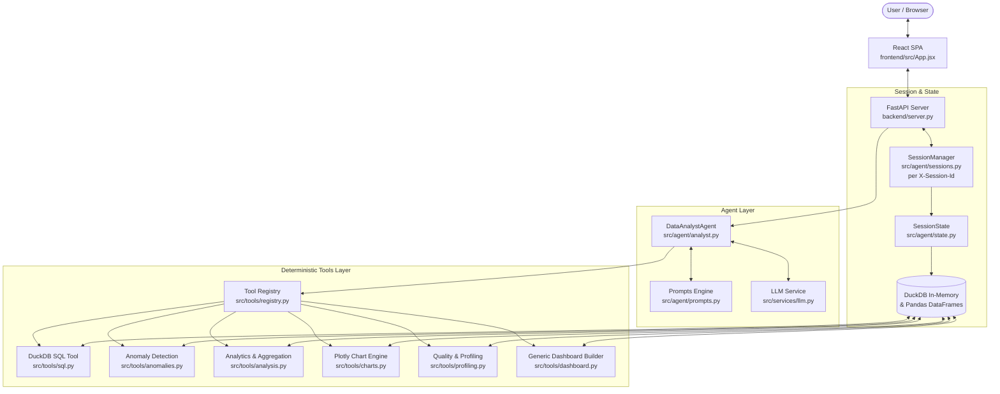

# AI Data Analyst Architecture & Design Specification

## Overview
The **AI Data Analyst** is a production-grade analytical platform designed to provide conversational data exploration over tabular datasets (CSV files). 

Unlike naive LLM wrappers that ask language models to calculate numbers directly or blindly run unvetted code, this system implements an **orchestrator-tool pattern with strict deterministic verification**:
- The **LLM** acts purely as a semantic router, planner, and narrative synthesizer.
- All mathematical aggregations, ranking, correlations, outlier detections, and visualizations are performed by **deterministic Python/DuckDB tools**.
- The LLM receives actual calculated data points and translates them into actionable business insights without hallucination.

---

## 1. System Architecture Diagram

> Legacy Streamlit UI (`backend/app.py`) is deprecated; production UI is the React SPA.

---

## 2. 7-Step Analytical Execution Lifecycle

Every user query flows through a 7-step deterministic cycle:

1. **Understand Intent & Context**: The agent ingests the user's natural language question alongside previous conversation turns.
2. **Inspect Catalog & Schemas**: The agent retrieves the current schema, column dtypes, distinct values, and sample data from `SessionState`.
3. **Select Tool & Formulate Plan**: The LLM generates a structured `QueryPlan` adhering to a Pydantic schema, declaring the target tool and required arguments.
4. **Invoke Deterministic Tool**: The selected tool (SQL, top-k, outlier detection, chart generation) is called via `ToolRegistry`.
5. **Receive Actual Results**: Concrete, mathematical results (record sets, outlier fences, correlation matrix, or Plotly spec) are returned.
6. **Validate Integrity**: The system validates row counts, bounds, and execution status.
7. **Synthesize Verified Explanation**: The LLM explains the findings in natural language using the verified numbers, adding business takeaways.

---

## 3. Security & Safety Controls

1. **No Arbitrary `exec()`**: The system does not execute LLM-generated Python scripts at runtime.
2. **SQL Read-Only Enforcement**: All queries passed to DuckDB undergo strict regex and AST validation to block `DROP`, `DELETE`, `INSERT`, `UPDATE`, `ALTER`, `ATTACH`, `COPY`, and file-system commands.
3. **Isolated Memory Catalog**: Uploaded datasets are maintained in DuckDB memory spaces and isolated session caches.
4. **Offline Fallback Guarantee**: If no external LLM API key is configured, an intelligent heuristic planner ensures all core functionalities work seamlessly offline without service failure.
