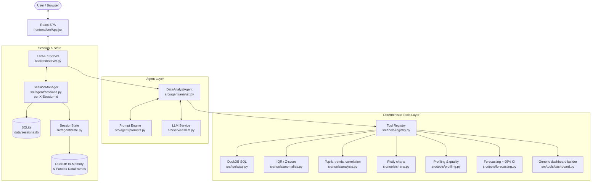

# AI-Powered Data Analyst — Build Summary

A production-grade, conversational Data Analyst platform built for the **Digital Back Office
Software Engineer Intern Assignment**. Users upload one or more CSV files and interact with the
data in natural language: rankings, trends, charts, SQL/Pandas code, anomaly audits with
explanations, dashboards, forecasting, and exportable reports — through a ChatGPT-style
streaming interface.

- **Backend:** FastAPI + DuckDB + Pandas + Pydantic v2, managed with `uv` (`backend/`)
- **Frontend:** Vite + React 19 SPA with Plotly visualizations (`frontend/`)
- **LLM (default):** `meta/muse-glimmer-30b` on NVIDIA NIM, with a full offline heuristic fallback
- **Tests:** 83 passing (`backend/tests/`, `uv run pytest tests/ -v`)
- **Deploy:** `docker compose up --build` → `http://localhost:8000`

---

## 1. Architecture

**Strict layering:** UI renders only (`frontend/src/`); API routes + per-session handling (`server.py`);
orchestration (`src/agent/`); deterministic compute (`src/tools/`); LLM transport (`src/services/`);
typed contracts (`src/models/`); logging, CSV ingestion, JSON safety, SQLite store (`src/utils/`).
The legacy Streamlit UI (`backend/app.py`) is deprecated and not served.

---

## 2. Assignment Coverage

| Requirement | Implementation |
|---|---|
| Upload + validate one or more CSVs | `POST /api/upload` (multi-file), encoding fallback UTF-8→cp1252→latin-1 (`utils/csv.py`), empty-file rejection |
| Answer questions in natural language | 7-step agent lifecycle with score-based intent router + follow-up resolution |
| Business insights & summaries | Tool-grounded synthesis (live LLM) or deterministic `_offline_synthesis` with real numbers |
| Charts (Bar, Line, Pie, Scatter…) | Plotly bar/line/pie/scatter/histogram/box; auto-aggregation of raw rows; auto-attached charts on rankings |
| SQL and/or Pandas code | Every answer ships generated DuckDB SQL + equivalent Pandas in copyable drawers |
| Anomalies + why flagged | IQR (Tukey fences) + Z-score with per-point math explanations; dataset-wide scan-all |
| Explain reasoning | "Thought for N seconds" trace with per-step log + tool attribution |
| Conversation context | Multi-turn history + SQLite persistence across restarts |
| Multi-file analysis | JOIN planning on shared keys across uploaded tables |
| Dashboard generation | Claude-style artifact panel + `/api/dashboard` (schema-aware, any CSV) |
| Data quality checks | Completeness score, duplicates, missingness, constant columns |
| Forecasting | Holt-style projection with 95% CI + Plotly band chart |
| Agentic workflows + tool calling | Plan → validate → execute → retry → fallback; `ToolRegistry` with typed schemas |
| Streaming responses | `POST /api/chat-stream` (SSE: status → tokens → result), stop + regenerate |
| Observability/logging | Structured logging (`utils/logging.py`) throughout agent/tools/API |
| Evaluation framework | `utils/evaluation.py` + 83-test suite |
| Export reports | `/api/export-report` executive HTML report |
| Docker support | Multi-stage `Dockerfile` (Node build + uv Python) + `docker-compose.yml` |
| Sample datasets | `backend/data/samples/` + explicit opt-in "load sample datasets" button |

---

## 3. Agent Workflow (`src/agent/analyst.py`)

Every dataset question runs a **7-step deterministic lifecycle**:

1. **Understand intent + context** — score-based router (synonym groups, exact + fuzzy column
   matching, dataset anchors, upload language like "this file") separates dataset queries from
   chit-chat; follow-up references ("show it as a pie chart") inherit prior table/columns.
2. **Inspect catalog + schema** — full schema summary (types, null%, distinct, samples) grounds planning.
3. **Select tool + formulate plan** — live LLM returns a `QueryPlan` (Pydantic-validated); offline
   heuristic planner is schema-aware (target-table-first column resolution).
4. **Call the deterministic tool** — plan is repaired against the active frame, SQL is validated
   (catalog tables, `active_dataset` alias resolution, enforced `LIMIT`), then executed with **one
   automatic retry** on failure and fallback to profiling rather than an error dump.
5. **Receive verified results** — real numbers only; the LLM never computes.
6. **Validate integrity** — per-tool checks with numbers (group counts, row counts, CI containment,
   trace counts) instead of a placeholder string.
7. **Synthesize explanation** — live LLM narration or deterministic grounded summary; tool-generated
   Pandas/SQL propagated when the plan omits them; rankings auto-attach a bar chart.

Special paths: LLM-generated greetings from a capabilities system prompt (never templates),
dashboard artifacts, dataset-required notices, anomaly scan-all across every numeric column.

---

## 4. LLM Integration (`src/services/llm.py`)

- **Default:** `meta/muse-glimmer-30b` via NVIDIA NIM OpenAI-compatible endpoint
  (shorthands like `muse-glimmer` auto-resolve; verified against NIM's model listing).
- **Token budget** defaults to 4096 (`LLM_MAX_TOKENS`) — reasoning models exhaust small budgets
  mid-thought and return `content: null`.
- **Reasoning traces are never served:** null/empty content raises (even with reasoning present);
  reasoning deltas are swallowed in streams; the agent falls back to grounded summaries.
- **Resilience:** malformed bodies raise catchable errors; `content: null` can never reach
  `AgentResponse` (previously a 500); provider timeouts default to 30s with fast deterministic
  degradation.
- **Offline heuristic fallback** (no key): schema-aware planning (JOINs, scan-all flag,
  target-table column priority) + canned conversational templates, always labeled offline in the UI.
- **Connection self-test:** `POST /api/llm-test` checks connectivity, model listing, and key
  validity in seconds (Settings → Test connection).
- **Honesty:** header badge (Live LLM vs Offline), mode-aware greetings, persisted provider/key/model
  settings, empty answers impossible by construction.

---

## 5. Sessions & Persistence

- **Per-browser isolation** via `X-Session-Id` (`src/agent/sessions.py`); requests without one share
  a `"default"` session; `POST/DELETE /api/session` manage lifecycle.
- **Sessions start empty** — samples are never auto-loaded (opt-in button only).
- **SQLite store** (`src/utils/sqlite_store.py`, `data/sessions.db`, WAL, 0600 perms):
  `sessions` (active table), `datasets` (original CSV bytes + filename), `messages` (full history
  with tool metadata), `app_settings` (e.g. stored API key helpers).
- Uploads, active-table switches, and every chat message write through; on a memory miss (restart)
  the session rebuilds datasets (re-parsed), DuckDB tables, active table, and history —
  **uploaded files stay in the conversation context**, including follow-up resolution state.
- Clearing chats deletes the server session and rotates the id for a true reset.

---

## 6. Frontend (ChatGPT-style UX)

- Centered composer with CSV attach + drag-and-drop, model picker, live LLM/offline badge.
- **Streaming answers** with status pill, blinking cursor, thinking-trace accordion, stop button.
- Regenerate button, chat search, grouped chat history, likes, copy buttons, empty-state
  suggestion cards + opt-in sample loader, artifact side panel (dashboard), tabular/anomaly views.
- `Vite proxy` for `/api` in dev; `npm run build` output served by FastAPI in prod.

## 7. API Endpoints

`GET /api/health` (incl. LLM status) · `GET /api/catalog` · `POST /api/session` ·
`DELETE /api/session` · `POST /api/load-samples` · `POST /api/select-dataset` ·
`POST /api/upload` · `POST /api/chat` · `POST /api/chat-stream` (SSE) ·
`GET /api/dashboard` · `GET /api/export-report` · `POST /api/clear-chat` ·
`POST /api/llm-test` · SPA fallback serving the React build.

## 8. Quality Notes

- 83 tests across agent workflow, streaming parity, sessions/persistence, CSV encodings,
  SQL safety, LLM wiring/resilience, vendor-neutrality of answers, and JSON serialization.
- Real bugs found and fixed along the way: cp1252 sample upload failure, numpy 500s in chart
  specs, single-user global state, hardcoded sales-schema assumptions, prompt-echoing and
  thinking-trace leaks, a `.lower()` crash blanking the UI (caught via headless-Chromium CDP).
- Vendor/company/model names appear nowhere in agent answers (regression-tested); API model IDs
  remain in Settings as required API contract, and docs credit sources factually.
